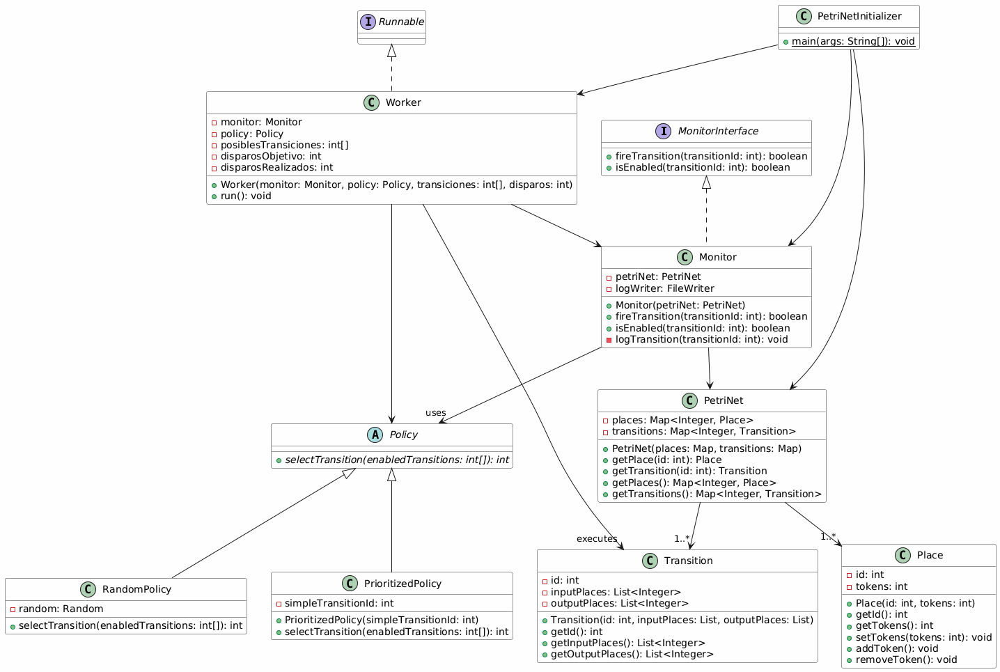
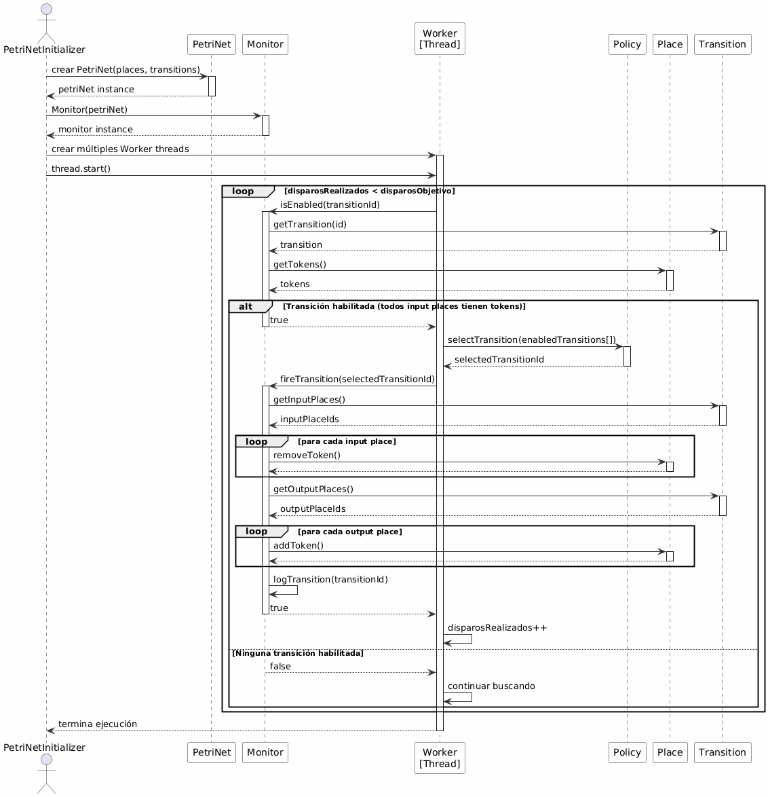

# Final Practical Project - Concurrent Programming

## Concurrent Petri Net Simulator

This project implements a **Petri Net simulator** using Java with concurrent programming. The objective is to simulate the behavior of concurrent systems by triggering transitions in a Petri net, using multiple threads (workers) and a synchronized monitor.


---

## Table of Contents

1. [General Description](#general-description)
2. [Petri Net Concepts](#petri-net-concepts)
3. [Project Architecture](#project-architecture)
4. [Main Components](#main-components)
5. [Diagrams](#diagrams)
6. [Execution](#execution)

---

## General Description

### Purpose

To simulate the concurrent execution of a **Petri Net**, where multiple threads (Workers) trigger transitions simultaneously under the synchronized control of a Monitor. Execution respects the net's invariants and uses different **selection policies** to choose which transition to trigger.


### Features

- ✅ Concurrent execution of multiple workers
- ✅ Synchronization using Monitor (concurrent Java pattern)
- ✅ Configurable policies: Random and Prioritized
- ✅ Logging of all events
- ✅ Petri net invariant verification

---

## Petri Net Concepts

A **Petri Net** is a mathematical model for representing concurrent and distributed systems.

### Elements

- **Places**: Nodes that store tokens (P1, P2, etc.)
- **Transitions**: Actions that transfer tokens between places
- **Tokens**: Resources that move through the network
- **Arcs**: Connections between places and transitions

### Triggering Rule

A transition is **enabled** if:
- All input places have at least 1 token

When it triggers:
- **1 token** is removed from each input place
- **1 token** is added to each output place

---

## Project Architecture

### Folder Structure

```
Petri/
├── Place.java # Storage nodes (places)
├── Transition.java # Actions (transitions)
├── PetriNet.java # Main network structure
├── Monitor.java # Synchronized trigger control
├── MonitorInterface.java # Monitor interface
├── Policy.java # Abstract class for policies
├── RandomPolicy.java # Random selection
├── PrioritizedPolicy.java # Prioritized selection
├── Worker.java # Thread that executes triggers
├── PetriNetInitializer.java # Main initializer
├── VerificarInvariante.java # Invariant verification
└── README.md # This file
```

---

## Main Components

### 1. **Place**

Represents a storage node on the network.

``java
public class Place {

private final int id; // Unique identifier

private int tokens; // Number of tokens

/ Main methods

public int getTokens() // Get tokens

public void addToken() // Add token

public void removeToken() // Remove token

}
```

**Responsibilities:**
- Store and manage tokens
- Provide thread-safe methods for accessing tokens

---

### 2. **Transition**

Represents an action on the network.

``java
public class Transition {

private final int id; // Unique identifier

private final List<Integer> inputPlaces; // Input places

private final List<Integer> outputPlaces; // Output Places

// Main Methods

public List<Integer> getInputPlaces()

public List<Integer> getOutputPlaces()

}
```

**Responsibilities:**
- Define relationships between places
- Store input and output information

---

### 3. **PetriNet (Petri Net)**

Main container that stores all places and transitions.

``java
public class PetriNet {

private final Map<Integer, Place> places; // All places

private final Map<Integer, Transition> transitions; // All transitions

// Main methods

public Place getPlace(int id)

public Transition getTransition(int id)

public Map<Integer, Place> getPlaces()

public Map<Integer, Transition> getTransitions()
}
```

**Responsibilities:**
- Maintain the complete network structure
- Provide access to specific components

---

### 4. **MonitorInterface**

Interface that defines the synchronization contract.

``java

public interface MonitorInterface {
boolean fireTransition(int transitionId); // Trigger a transition
boolean isEnabled(int transitionId); // Check if it is enabled
}
```

---
### 5. **Monitor (Synchronized Monitor)**

Implements the synchronized logic for triggering transitions. It is the **synchronization point** between workers.

``java
public class Monitor implements MonitorInterface {

private final PetriNet petriNet;

private FileWriter logWriter;

// Synchronized methods

public synchronized boolean fireTransition(int transitionId) {
// 1. Check if the transition is enabled

for (int placeId : transition.getInputPlaces()) {

Place place = petriNet.getPlace(placeId);

if (place.getTokens() == 0)

return false; // Not enabled 
} 

// 2. Remove input tokens 
for (int placeId : transition.getInputPlaces()) { 
petriNet.getPlace(placeId).removeToken(); 
} 

// 3. Add output tokens 
for (int placeId : transition.getOutputPlaces()) { 
petriNet.getPlace(placeId).addToken(); 
} 

// 4. Record in log 
logTransition(transitionId); 
return true; 
}

public synchronized boolean isEnabled(int transitionId) {

/ Check if all entry points have tokens

}
}
```

**Responsibilities:**
- Synchronize access to trigger transitions
- Verify transition enablement
- Log events
- Ensure network consistency

---

### 6. **Policy (Selection Strategy)**

An abstract class that implements the **Strategy** pattern for selecting transitions.

``java
public abstract class Policy {

public abstract int selectTransition(int[] enabledTransitions);

}
```

**Design Pattern:** Strategy
- Allows changing the selection algorithm at runtime
- Facilitates adding new policies without modifying the Worker

---

### 7. **RandomPolicy**

Selects a transition **randomly** from those available.

``java
public class RandomPolicy extends Policy {
private final Random random = new Random();

@Override
public int selectTransition(int[] enabledTransitions) {
if (enabledTransitions.length == 0) return -1;
return enabledTransitions[random.nextInt(enabledTransitions.length)];

}
}
```

---

### 8. **PrioritizedPolicy**

Prioritizes a specific transition if it is enabled; otherwise, it selects the first available one.

```java
public class PrioritizedPolicy extends Policy {

private final int priorityTransitionId;

@Override

public int selectTransition(int[] enabledTransitions) {

/ Find the priority transition
for (int t : enabledTransitions) {

if (t == priorityTransitionId)

return t; // Priority found

}
// If not found, return the first available one
return enabledTransitions.length > 0 ? enabledTransitions[0] : -1;

}
}
```

---

### 9. **Worker (Thread Executor)**

Class that implements `Runnable`. Each Worker executes transition triggers in its own thread.

``java
public class Worker implements Runnable {

private final Monitor monitor; // Synchronized access

private final Policy policy; // Selection Strategy

private final int[] possibleTransitions; // Allowed Transitions

private final int targetShots; // Target Shots

private int shotsTaken = 0; // Current Counter

@Override

public void run() {

while (shotsTaken < targetShots) {
// 1. Check for enabled transitions

List<Integer> enabled = new ArrayList<>();

for (int t : possibleTransitions) {

if (monitor.isEnabled(t)) {
enabled.add(t);

}
}

// 2. Check if transitions are available

if (!enabled.isEmpty()) {
int[] arr = enabled.stream().mapToInt(Integer::intValue).toArray();

// 3. Use policy to select

int selectedTransition = policy.selectTransition(arr);

// 4. Attempt to fire

if (monitor.fireTransition(selectedTransition)) {
fireTransitionsFired++;

}
}
}
}
}
```

**Responsibilities:**
- Run in parallel (each Worker on its own thread)
- Look for enabled transitions
- Use Policy to select
- Update the firing counter
- Synchronize with Monitor

---
### 10. **PetriNetInitializer**

Main class that initializes and runs the simulation.

``java
public class PetriNetInitializer {
public static void main(String[] args) {
// 1. Create places
Place p1 = new Place(1, 1); // Place 1 with 1 token
Place p2 = new Place(2, 0);

Place p3 = new Place(3, 0);

// 2. Create transitions
Transition t1 = new Transition(1,

Arrays.asList(1), // Input: P1

Arrays.asList(2) // Output: P2

);

// 3. Create the network
Map<Integer, Place> places = new HashMap<>();
places.put(1, p1); places.put(2, p2); places.put(3, p3); 

Map<Integer, Transition> transitions = new HashMap<>(); 
transitions.put(1, t1); 

PetriNet petriNet = new PetriNet(places, transitions); 

// 4. Create monitor 
Monitor monitor = new Monitor(petriNet); 

// 5. Create workers with policies 
Policy randomPolicy = new RandomPolicy(); 
Worker worker1 = new Worker(monitor, randomPolicy, 
new int[]{1, 2}, 5); // Target shots: 5 

// 6. Run in threads 
Thread t = new Thread(worker1); 
t.start(); 
t.join(); // Wait for it to finish 

// 7. Check result 
System.out.println("Final state: P1=" + p1.getTokens() + 
", P2=" + p2.getTokens());

}
}
```

---

## Diagrams

### Class Diagram



**Main Relationships:**
- `Worker` implements `Runnable` (concurrent pattern)
- `Monitor` implements `MonitorInterface` (synchronization contract)
- `Worker` uses `Monitor` and `Policy` (dependency injection)
- `RandomPolicy` and `PrioritizedPolicy` extend `Policy` (Strategy pattern)
- `PetriNet` contains `Place` and `Transition` (composition)

---

### Sequence Diagram



**Execution Flow:**

1. **Initialization:** PetriNetInitializer creates PetriNet, Monitor, and Workers

2. **Search:** Worker searches for enabled transitions (isEnabled)

3. **Selection:** Policy selects a transition from the enabled set

4. **Synchronized Firing:** Monitor synchronizes the fireTransition

5. **Update:** Input tokens are removed, output tokens are added

6. **Logging:** The event is logged

7. **Repetition:** The cycle continues until target firings are reached

---

## Design Patterns

### 1. **Strategy Pattern**
- **Location:** Policy, RandomPolicy, PrioritizedPolicy
- **Benefit:** Allows changing the selection algorithm without modifying the Worker

### 2. **Monitor Pattern**
- **Location:** Monitor class with synchronized methods
- **Benefit:** Synchronizes access to shared resources (PetriNet)

### 3. **Dependency Injection**
- **Location:** Worker receives Monitor and Policy in constructor
- **Benefit:** Facilitates testing and flexibility

### 4. **Template Method (implicit)**
- **Location:** Run() method in Worker follows a repetitive pattern
- **Benefit:** Clear and predictable structure

---

## Execution

### Compilation

```bash
cd Petri
javac *.java
```

### Execution

```bash
java PetriNetInitializer
```

### Output

```
Simulating 10 firings with 3 workers...
Petri_log.txt: Log of all events
Final state: P1=2, P2=3, P3=5
```

---

## Verification of Invariants

The `VerifyInvariant.java` class verifies that the network invariants are maintained:

```java
public class VerifyInvariant {
public static void main(String[] args) {
// Read petri_log.txt
// Rebuild state for each event
// Verify that the token sum is invariant

}
}
```

---

## Conclusion